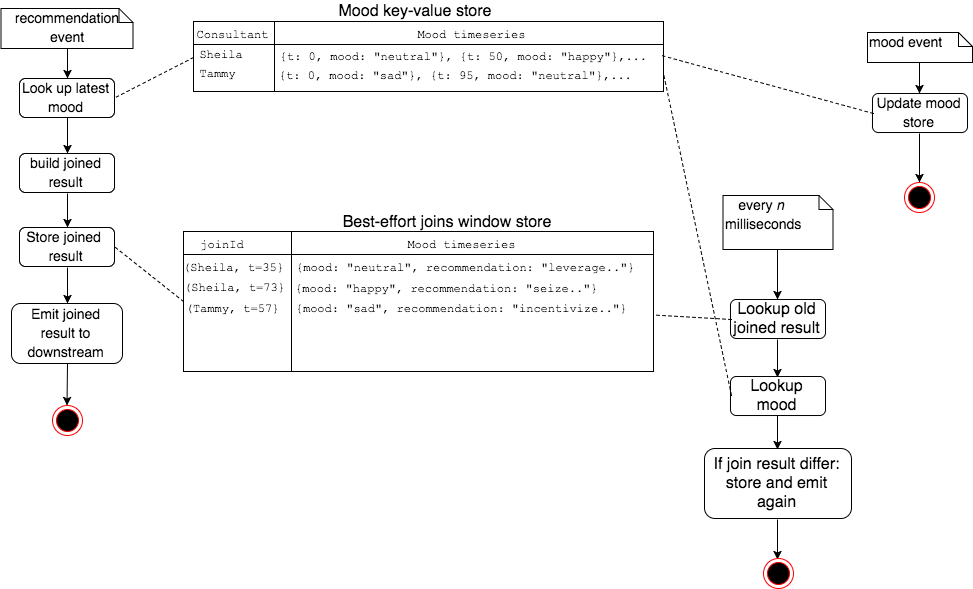

Title: Event time low-latency joins with Kafka Streams
Date: 2017-09-17
Tags: kafka, kafka-streams, stream-processing, scala
Author: Svend Vanderveken

This post attempts to illustrate the difficulty of performing an event-time join between two time series with a stream processing framework. It also describes one solution based on Kafka Streams 0.11.0.0.

An event-time join is an attempt to join two time series while taking into account the timestamps. More precisely, for each event from the first time series, it looks up the latest event from the other that occurred before it. This blog post is based on Kafka Stream although I found the original idea in this [Flink tutorial](http://training.data-artisans.com/exercises/eventTimeJoin.html), where the idea of event-time join is very well explained. 

Event-time join are often required in practise. For example, given a stream of transactions and another one of customer profile updates, we might want to associate each transaction to the corresponding customer profile as it was known at the moment of the transaction. Or given a stream of traffic information and another one of weather updates, we might want to associate each traffic event with the latest weather that was known for that location at that point in time. 

Note that an event-time join is not symmetric: performing an event-time join from stream 1 to stream 2 does not yield the same result as performing it from stream 2 to stream 1.

# Difficulty and opportunity related to streaming approach 

If we were in a batch context, implementing an event-time join would be pretty straightforward. By batch context I mean one where "all the data is available", so that the execution of an aggregation like `max(orderDate)` is guaranteed to provide the last order date of the full dataset. 

For example, assume we have a dataset of customer visit events and another one of orders. Both are timestamped and both are thus representing time series. Suppose we want to look up, for each customer visit, the latest order performed by that customer _before_ the visit. In Batch mode, we can simply look up the latest known order before the visit (`Orders.OrderDate <= CustomersVisit.VisitDate` in the example below) and join that to the visit information. One possible illustration might be:

```sql
/**
  One batch approach to linking each customer visit to their latest order that occured before that.
  (probably not optimal, though hopefully clear enough to illustrates my purpose)
 */
SELECT CustomerOrderAsOfVisitDate.VisitId as visitID, 
       CustomerOrderAsOfVisitDate.CustomerId as customerId, 
       Orders.OrderDate as lastOrderDateBeforeVisit, 
       Orders.ShipperId orderShipperId
	FROM Orders
    LEFT JOIN (
      -- latest order date occuring before each visit
      SELECT CustomersVisit.VisitId, CustomersVisit.CustomerId, max(orderDate) as lastOrderDate
          FROM CustomersVisit 
          JOIN Orders 
          ON (Orders.CustomerId == CustomersVisit.CustomerId AND
              Orders.OrderDate <= CustomersVisit.VisitDate) 
          GROUP BY CustomersVisit.VisitId, CustomersVisit.CustomerId
    ) AS CustomerOrderAsOfVisitDate
    on (CustomerOrderAsOfVisitDate.CustomerId == Orders.CustomerId AND
        CustomerOrderAsOfVisitDate.lastOrderDate == Orders.OrderDate)

```

visitID  | customerId | lastOrderDateBeforeVisit | orderShipperId
  ------------- | ------------- | ----------- | -----
12 | Ana Trujillo   | 1996-09-18  | 3
14 | Antonio Moreno | 1996-11-27 |	2
15 | Around |    1996-12-16	| 3
16 | Berglunds | 1996-12-16	| 3


A typical crux of stream processing though is the fact that datasets are unbounded and considered theoretically infinite. This implies that at any point in time, we cannot be sure that we have received all necessary information to compute the final version of anything. In the example above, this means that `max(orderDate)` only returns the latest order date _observed so far_, though that's an aggregation that's ever changing. 

Also, because of delays that could happen during data ingestion, it is typically considered that events are not guaranteed to be delivered in order (see discussion in [Flink's documentation on Event time vs Processing time](https://ci.apache.org/projects/flink/flink-docs-release-1.3/dev/event_time.html) and [Spark's time handling documentation](https://spark.apache.org/docs/2.2.0/structured-streaming-programming-guide.html#handling-event-time-and-late-data))

This limitation applies also in the case of event-time join: any time we receive a transaction or a car traffic information, we cannot in general be sure that the information we current have concerning user profiles or weather time series is the latest that we will ever be available. We could decide to wait, though how long?

This question of "how long to wait" is one key difference between stream and batch processing. In a batch approach, some data collection process is assumed to have "waited long enough" beforehand so that at the moment of the batch execution, we can consider that "all data is available". Said otherwise, "waiting long enough" is not a concern of the batch implementation whereas it is a first class citizen in stream processing. 

In many cases though, a nightly batch that processes the last day's data are nothing less than a manual implementation of a 24h [tumbling window](https://ci.apache.org/projects/flink/flink-docs-release-1.3/dev/windows.html#tumbling-windows). Hiding the stream nature of a dataset behind nightly batches is sometimes hiding too much the complexity related to time by pretending that "all data is available". In many situations, we end up handling ourselves cases like late event arrivals or aggregations over more than one day (e.g. 30 sliding trends), which are much more natural if we use a framework that embrace the infinite time series nature of the dataset. 

# Why not relying on Kafka Streams event-time based processing

Kafka Streams 0.11.0.0 does not offer out-of-the box event time join.

It does provide however a couple of handy primitives for designing stream processing based on event time, as explained in the [Kafka Streams concepts documentation](https://docs.confluent.io/current/streams/concepts.html#time). As far as I understand however, these features are primarily useful for [time-based window aggregations](https://docs.confluent.io/current/streams/developer-guide.html#streams-developer-guide-dsl-windowing) and [best effort flow control](http://docs.confluent.io/current/streams/architecture.html?highlight=flow%20control#flow-control-with-timestamps).  

Kafka Streams DSL also exposes [KStreams-to-KTable join](https://docs.confluent.io/current/streams/developer-guide.html#kstream-ktable-join) which essentially corresponds to looking up up-to-date reference data in real time. Confluent has published two excellent blogs about it ([here](https://www.confluent.io/blog/watermarks-tables-event-time-dataflow-model/) and [here](https://www.confluent.io/blog/distributed-real-time-joins-and-aggregations-on-user-activity-events-using-kafka-streams/)). Combined with Kafka Streams's built-in best-effort flow control, this is already quite powerful and probably exactly what we need in many cases. As a point of comparaison, at the time of writing this, this feature is not (yet?) available as part of Spark Structured Streaming (2.2.0) out of the box.

Ktable-to-KStream however corresponds to a lookup done at processing time (as mentioned in [KStream::join javadoc](https://kafka.apache.org/0110/javadoc/org/apache/kafka/streams/kstream/KStream.html#join(org.apache.kafka.streams.kstream.KTable, org.apache.kafka.streams.kstream.ValueJoiner))). To fully support event-time-join of out of order streams, we need to manually keep some buffers of both streams, which is explained below.


# High level approach 

As mentioned in the introduction, this post is inspired from the [Flink event-time join tutorial](http://training.data-artisans.com/exercises/eventTimeJoin.html), and my  solution is almost a copy-cat of [their suggested solution](https://github.com/dataArtisans/flink-training-exercises/blob/master/src/main/scala/com/dataartisans/flinktraining/exercises/datastream_scala/lowlatencyjoin/EventTimeJoinHelper.scala).

The gist of my solution is very simple: 

- keep in mind that an event-time join is an asymmetric operation. Let's name the first stream the _transaction stream_ and the one we are join it to the _dimension stream_
- upon receiving a _dimension event_, just record it in a time-bounded buffer (e.g. TTL = 1 day or so)
- upon receiving a _transaction event_, perform a best effort join, i.e. join it with the dimension information available at that moment
- schedule an action that review previously joined information and emits corrected joins when necessary

Here is an illustration where the transaction stream is a stream of recommendations and the dimension stream is a stream of mood events (this use case is detailed in the code sample below): 

<center> </center>

Note that the result of this is what I call a _revision log_, i.e. a stream that contains one or several successive revisions of a given information (here, the result of the join). From the point of view of a consumer, only the latest version should be considered for each key. This matches exactly what Kafka Streams calls a [KTable](https://docs.confluent.io/current/streams/concepts.html#streams-concepts-ktable).

# The code!

## Major Kafka Streams components I am using 

Note that this is all written with Kafka 0.11.0.0 in mind whose API is likely to change in the future. In particular, [KIP-138](https://cwiki.apache.org/confluence/display/KAFKA/KIP-138%3A+Change+punctuate+semantics) which is [planned to be released as part of Kafka 1.0](https://cwiki.apache.org/confluence/pages/viewpage.action?pageId=71764913) will change slightly the semantics of `punctuate`, which I rely upon below.

- The [processor API](https://docs.confluent.io/current/streams/developer-guide.html#processor-api) that allows a low level access to the events. 

- The ability to create a stateful stream by creating a [local though fault-tolerant state stores](https://docs.confluent.io/current/streams/developer-guide.html#state-stores). These state stores are local, persistent (backed by a Kafka topic) and transparently re-created on any node in case of restart. 

- In particular, [window store](https://docs.confluent.io/current/streams/developer-guide.html#fault-tolerant-state-stores) are an awesome feature that greatly simplifies stream processing since they automatically clean up old data from the local buffer. Also, They allow us to store value associated to a key and a timestamp, like this: `store.put(key, value, timestamp)` and then retrieve all values for this key within a given time range, like this:  `store.fetch(key, fromTime, toTime)`. 

- The API allow us to [listen to several topics at once](https://docs.confluent.io/current/streams/javadocs/org/apache/kafka/streams/kstream/KStreamBuilder.html#stream-org.apache.kafka.common.serialization.Serde-org.apache.kafka.common.serialization.Serde-java.lang.String...-) and even to listen to a [topic name regexp](https://docs.confluent.io/current/streams/javadocs/org/apache/kafka/streams/kstream/KStreamBuilder.html#stream-java.util.regex.Pattern-) ! This simple feature removes the need in this case of specific API for multiple inputs like [Flink's CoProcessFunction](https://ci.apache.org/projects/flink/flink-docs-release-1.3/api/java/org/apache/flink/streaming/api/functions/co/CoProcessFunction.html). 


## Code walkthrough 

With all this explained and explored, the actual implementation is pretty straightforward. I pushed a proof of concept in Scala to my [event-time-join-with-kafka-streams github repo](https://github.com/sv3nd/event-time-join-with-kafka-streams).

In this example, we are going to process an event stream of consultant's recommendation (I'm a consultant myself, so I know best). A recommendation event looks like that:

```json 
{
  "ingestion_time": 697,
  "consultant": "Sheila",
  "event_time": 520,
  "recommendation": "seize proactive interfaces"
}
```

In order to perform _advanced_ analytics, we're going to join it with stream of known mood of said consultants. Here's an example of consultant's mood event: 

```json
{
  "ingestion_time": 696,
  "name": "Tammy",
  "event_time": 0,
  "mood": "neutral"
}
```

Each of these events are delivered potentially out of order with arbitrary delays. We want to perform an event-time join, i.e. for each recommendation event, lookup the most recent known mood before the recommendation.

The processing topology is very simple, we just parse the incoming `mood` or `recommendation` events and provide them to our `EventTimeJoiner` implementation: 

```scala
val parsed = builder
  // read events from both Kafka topics
  .stream(Serdes.String(), Serdes.String(), "etj-moods", "etj-events")
    
  // parse the Json into a stream of Either[Recommendation, Mood]
  .mapValues[Option[Either[Recommendation, Mood]]](EventTimeJoinExample.parse)
  .filter{ case (_, v: Option[Either[Recommendation, Mood]]) =>  v.isDefined }
  .mapValues[Either[Recommendation, Mood]](_.get)
    
  // watch out: selectKey does not trigger repartitioning. My test data is already partionned => in this specific case it's ok
  .selectKey[String]{ case (_, v) => EventTimeJoinExample.userId(v)}
    
  // actual event-time join
  .transform(EventTimeJoiner.supplier, "moods", "bestEffortJoins",  "consultants")
```

The `EventTimeJoiner` maintains 3 State stores: one containing the time series of moods of each consultant, another containing the joined events we have emitted recently and finally a 3rd one to recall all the consultant's names we have encountered recently: 

```scala
var moodStore: KeyValueStore[String, List[Mood]] = _
var bestEffortJoinsStore: WindowStore[String, MoodRec] = _
var consultantNamesStore : WindowStore[String, String] = _
```

In the `transform()` method we have most of the high level logic mentioned above: 

- if we receive a mood event, we just record that mood within the time series of the corresponding consultant in the `moodStore`
- if we receive a recommendation event, we join it to the mood information we currently have, we record that in the `bestEffortjoinStore` and we emit it 

```scala
def transform(key: String, event: Either[Recommendation, Mood]): KeyValue[String, MoodRec] =
  event match {
    case Left(rec) =>
      val joined = join(rec.event_time, rec.consultant, rec.recommendation)
      bestEffortJoinsStore.put(rec.consultant, joined, rec.event_time)
      recordConsultantName(rec.consultant, rec.event_time)
      new KeyValue(key, joined)

    case Right(mood) =>
      val updatedMoodHistory = (mood :: moodHistory(mood.name)).sortBy( - _.event_time)
      moodStore.put(mood.name, updatedMoodHistory)
      recordConsultantName(mood.name, mood.event_time)
      null
  }
      
def join(recommendationTime: Long, consultant: String, recommendation: String): MoodRec = {
 val maybeMood = moodHistory(consultant)
  .dropWhile(_.event_time >= recommendationTime)
  .headOption
  .map(_.mood)

  MoodRec(recommendationTime, consultant, maybeMood, recommendation)
}    
```

This is only half of the story of course, since we also need to schedule a periodic review of that join result. This is very easy do to in Kafka Streams by simply requesting our `punctuate()` method to be invoked every (say) 1000ms _in event time_ (whose definition depends on how we configured our [timestamp-extractor](https://docs.confluent.io/current/streams/developer-guide.html#streams-developer-guide-timestamp-extractor), and here again keep in mind that [KIP-138](https://cwiki.apache.org/confluence/display/KAFKA/KIP-138%3A+Change+punctuate+semantics) is on its way to revisit that): 

```scala 
def init(context: ProcessorContext): Unit = {    
  context.schedule(1000)
}
```


And once we're there we're essentially done. All that's left to do is to let `punctuate()` revisit the join result of all recently witnessed consultants and, if any difference is found, re-emit the updated join result. Note in passing the awesome `fetch()` method of the window store which let us easily query a time series by range. The `joinAgain()` method is not shown here, though essentially it just revisit the join result

```scala 
def punctuate(latestEventTime: Long): KeyValue[String, MoodRec] = {
  allRecentConsultants(until = latestEventTime).foreach {
    name => joinAgain(name, maxEventTimestamp = latestEventTime - reviewLagDelta)
  }
  null
}
  
def allRecentConsultants(until: Long): Iterator[String] =
  consultantNamesStore.fetch("all-recent-names", BEGINNING_OF_TIMES, until).asScala.map(_.value)
```

Note that my code at that point gets a bit dirty and in particular, lacks some necessary clean up of some key-value store. Yeah, I'm that lazy...

# Conclusion

I really love the Kafka Streams abstractions, the duality between logs and tables is beautifully present a bit everywhere, which offers a refreshing way of designing both data processing solutions but also plain reactive micro-services. Also, Kafka Streams is just a very thin layer on top of the core functionalities offered by Kafka clusters and Kafka consumers/producers. A KTable is essentially a compacted topics on steroids, a join boils down to pushing key-values to a topic and letting Kafka's partitioning by key co-locating the data, local distributed state stores are event-sourced to Kafka topics again which makes them transparently replicated....

This of course means that Kafka streams is very tightly coupled to the underlying Kafka cluster. This is a very different positioning than Flink or Spark Structured Streaming which are planned for various streamed input and output technologies.

I like less the current java-only API which is very OO-based, encourages mutating objects and makes explicit use of null values. For example instances of `Transformer` (and several other API components) must be classes created with null instance members that are later on initialised in the `init()`. My preference would have been for relying more on immutable constructs. Likewise differences between scala and java generics semantics imply that [scala code becomes less elegant than what it could be](https://docs.confluent.io/current/streams/faq.html#scala-compile-error-no-type-parameter-java-defined-trait-is-invariant-in-type-t). 

Kafka Streams is a young project though, so one can hope that a functional-oriented and scala based API might be offered at some point in the future (pretty please?)

