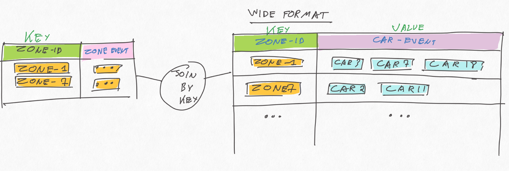
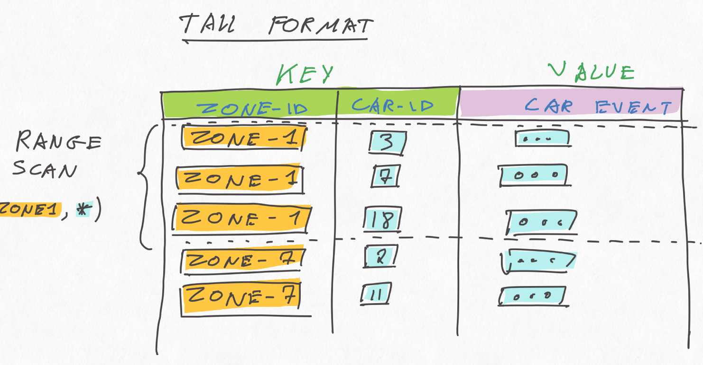
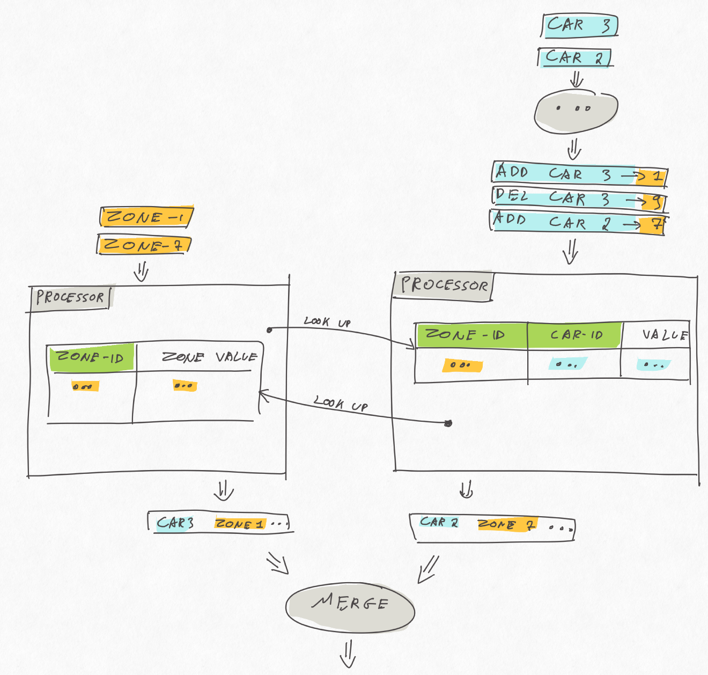

Title: One-to-many Kafka Streams Ktable join
Date: 2019-04-30
Tags: kafka
Author: Svend Vanderveken

Kafka Streams is a lightweight data processing library for Kafka. It's build on top of the Kafka consumer/producer APIs and provides higher level abstractions like streams and tables that can be joined and grouped with some flexibility. 

One current limitation is the lack of non-key table join, i.e. impossibility to join 2 tables on something else than their primary key. 

This post discusses approaches to work around this limitation. 

TLDR: 

 * For now, use composite keys in a state store and query it with a range scan. 
 * Alternatively, wait for (or contribute to) KIP-213.

An example implementation of my suggested approach is present on github: [https://github.com/sv3ndk/kafka-streams-one-to-many-join](https://github.com/sv3ndk/kafka-streams-one-to-many-join)

# Example use case

Imagine a scenario with cars moving around a city. We receive two streams of events: the position of the cars in real time and the pollution level in various locations, along those simple formats: 

```scala 
  case class CarArrivalEvent(car_id: Int, to_zone_id: Int, fuel_level: Double)
  case class ZoneEvent(zone_id: Int, pollution_level: Double)
```

Our purpose is to maintain a view with the latest known position and pollution level exposure for each car:  

```scala 
  case class JoinedCarPollutionEvent(car_id: Int, zone_id: Int, fuel_level: Double, pollution_level: Double)
```

The twist is that we want to update that view as early as new information is available, i.e

* when the known location of a car changes, use the latest known pollution level of the new zone
* when the pollution level of a zone changes, update all the cars in that zone accordingly. 

# 4 solutions with trade-offs

The next section will present my suggested solution based on the current version of Kafka Stream. Before that, the present section discusses 4 other approaches that each change a bit the problem definition before solving it (sometimes, the solution to a hard problem is to solve another problem...). 

## 1) Incomplete: stream to Ktable join

One attempt could be to maintain the latest pollution level per zone in one `KTable` and simply join the car location event stream to it, as follows: 


This is simple and should provide the correct results, but not often enough. The issue is that such [Stream-to-Table join](https://kafka.apache.org/22/documentation/streams/developer-guide/dsl-api.html#kstream-ktable-join) is updated only when a new car position event is received on the `KStream`, not when the pollution level of a zone changes in the `KTable`. Said otherwise, if the pollution level of a zone changes in this setup, the view will not be updated, which does not fulfill our requirements.

## 2) Wasteful: table to table join with wide format 

The only kind of joins that gets updated whenever either side receives an event is a [`KTable`-to-`KTable` join](https://kafka.apache.org/21/documentation/streams/developer-guide/dsl-api.html#ktable-ktable-join). As mentioned in the introduction, those joins are (currently) only possible as equi-join on the primary key. 

One somewhat hackish solution consists in building a "wide table" of car events, keyed by zoneId, and join it to the zone `KTable`, as follows: 



This should work and be updated as often as we want, but can quickly be very inefficient due to:

*  write-amplification: any time a car location event arrives, a whole car list row gets updated on the wide table, which is then event-sourced to an underlying topic 
* shuffling


If the expected number of car events per wide row is high, this can lead to unacceptably low performance and high resource costs. 

## 3) Soon: KIP-213

We're not alone! A [PR](https://github.com/apache/kafka/pull/5527) by Adam Bellemare is currently on its way to Kafka that should hopefully resolve just that! The latest version of Kafka at the time of writing this is 2.2, let's keep an eye on it. 

## 4) Other engine: use Flink!

Flink is not as lightweight as Kafka Stream: it's a full-fledged streaming platform and typically requires a more involved deployment setup. Both tools are thus positioned differently and comparing them here is not totally fair. 

Flink is an appealing option though. It has a very rich stream processing API that addresses both batch and streaming paradigms, integrates with Kafka as well as many other data sources, has a convenient savepoint feature and can be deployed to variety of runtime environments (k8s, standalone, AWS,...).

Back to our example, table-to-table joins support [more flexible predicates in Flink](https://ci.apache.org/projects/flink/flink-docs-release-1.8/dev/table/tableApi.html#joins), "only" requiring that the join includes at least one equality condition (thus not necessarily on the key). 

# State stores, tall format and range scans. 

Waiting for KIP-213 to reach Kafka Streams's trunk, or simply as an illustation of the possibilities that state store range scan opens, here's a solution based on Kafka Stream's low level [Transformer API](https://kafka.apache.org/20/documentation/streams/developer-guide/dsl-api.html#applying-processors-and-transformers-processor-api-integration). 

This solution is heavily inspired by this [awesome talk by Antony Stubbs (minute 13:48)](https://youtu.be/_KAFdwJ0zBA?t=828) as well as well as this [stream-to-table join example by Michael Noll](https://github.com/confluentinc/kafka-streams-examples/blob/5.2.1-post/src/test/java/io/confluent/examples/streams/CustomStreamTableJoinIntegrationTest.java). 

The basic idea is to use a tall format in a state store instead of the wide format of the `KTable` of the second solution above: 



The tall format has the advantage of avoiding the write amplifications mentioned earlier, while still allowing to retrieve all the car events per `zoneId` with a [range scan](https://kafka.apache.org/22/javadoc/org/apache/kafka/streams/state/ReadOnlyKeyValueStore.html#range-K-K-). In a way, it is _kinda_ similar to wide rows in Cassandra (without the sorting). 

Armed with this, we can store the car events following this tall format, while keeping the zone events keyed by zoneId as before. This yield the following stream overview: 



I implemented this with the [Transformer API](https://kafka.apache.org/22/documentation/streams/developer-guide/dsl-api.html#applying-processors-and-transformers-processor-api-integration). The state store for the zones is a usual key-value state store:

```scala
  val zoneEventStoreBuilder = Stores.keyValueStoreBuilder(
    Stores.persistentKeyValueStore("zone-events-store"),
    Serdes.Integer,
    DomainModel.JsonSerdes.zoneEventSerdes)
```

Whereas the state store for the cars is similar, but uses a composite key: 

```scala
  case class ZoneCarId(zoneId: Int, carId: Int)

  val carArrivalEventStoreBuilder = Stores.keyValueStoreBuilder(
    Stores.persistentKeyValueStore("car-arrival-events-store"),
    ZoneCarId.zoneCarIdJsonSerdes,
    DomainModel.JsonSerdes.carArrivalEventSerdes)
```

Each of those state-store is "owned" by a separate Transformer instance: [`CarEventLeftJoinZone`](https://github.com/sv3ndk/kafka-streams-one-to-many-join/blob/master/src/main/scala/poc/svend/DemoApp.scala#L164) and [`ZoneEventLeftJoinCar`](https://github.com/sv3ndk/kafka-streams-one-to-many-join/blob/master/src/main/scala/poc/svend/DemoApp.scala#L247).

Car events are partitioned by zone, then forwarded to the [`CarEventLeftJoinZone`](https://github.com/sv3ndk/kafka-streams-one-to-many-join/blob/master/src/main/scala/poc/svend/DemoApp.scala#L164) transformer, which stores them, looks up the corresponding zone in the zone state store, and, if all goes well, emits a join result immediately: 

```scala
  carArrivalEventStore.put(
    ZoneCarId(carEvent.zoneId, carEvent.carId),
    CarArrivalEvent(carEvent.carId, carEvent.zoneId, carEvent.fuelLevel))

  // if we know the pollution level of that zone: emit a join result
  Option(zoneEventStore.get(carEvent.zoneId))
    .map { zoneEvent =>
      JoinedCarPollutionEvent(carEvent.carId, carEvent.zoneId, carEvent.fuelLevel, zoneEvent.pollution_level)
    }
```

The pattern is very similar for the [`ZoneEventLeftJoinCar`](https://github.com/sv3ndk/kafka-streams-one-to-many-join/blob/master/src/main/scala/poc/svend/DemoApp.scala#L247), except that the look-up in the car event state store is a range scan, potentially matching many car events for a given zone. 

```scala
  zoneEventStore.put(zoneEvent.zone_id, zoneEvent)

  carArrivalEventStore
    .range(ZoneCarId(zoneEvent.zone_id, 0), ZoneCarId(zoneEvent.zone_id, Int.MaxValue))
    .asScala
    .foreach { kv =>

      val carEvent = kv.value
      this.processorContext.forward(carEvent.to_zone_id,
        JoinedCarPollutionEvent(carEvent.car_id, carEvent.to_zone_id, carEvent.fuel_level, zoneEvent.pollution_level)
      )
    }
```

You might have noticed that the car event processor receives `ADD` and `DEL` events instead of the raw car events. That's simply necessary to make sure each car is (eventually) recorded in only one zone at the same time. 

Again, for all this to work properly in a distributed fashion, we have to make sure that both streams are co-partitioned by `zoneId`. 

# One last word: only use streaming when batch is not an option

This post has provided an example of a processing which is trivially easy to implement with a batch approach while currently requiring substantial work with some current streaming solutions. 

_In theory_, "batch is a subset" of streaming, in the the sense that stream processing manipulates unbounded datasets while batches manipulate bounded datasets, which can be considered as a specific case of unbounded ones. Also, modern streaming paradigms like Beam, Flink and DataFlow provide abstractions to manipulate the stream's "logical time" (or event time) explicitly. Those frameworks allow to build low latency continuously updated _views_ that _eventually_ converge towards the exact result (cf the so called "Kappa" architecture). 

When this low latency is required or when the streaming nature of the processing is otherwise justified, that is pretty awesome. 

_In practise_ though, for some use cases, this can come at a substantial complexity cost, essentially because a batch job have the luxury to traverse fully a bounded data multiple times, there are many use cases which are much easier to implement in batch (like non equi joins, some complex nested queries or ML training). 

I don't see streaming fully replacing batch processing any time soon. What we need is building streaming platforms where both can co-exists and share datasets efficiently. 
