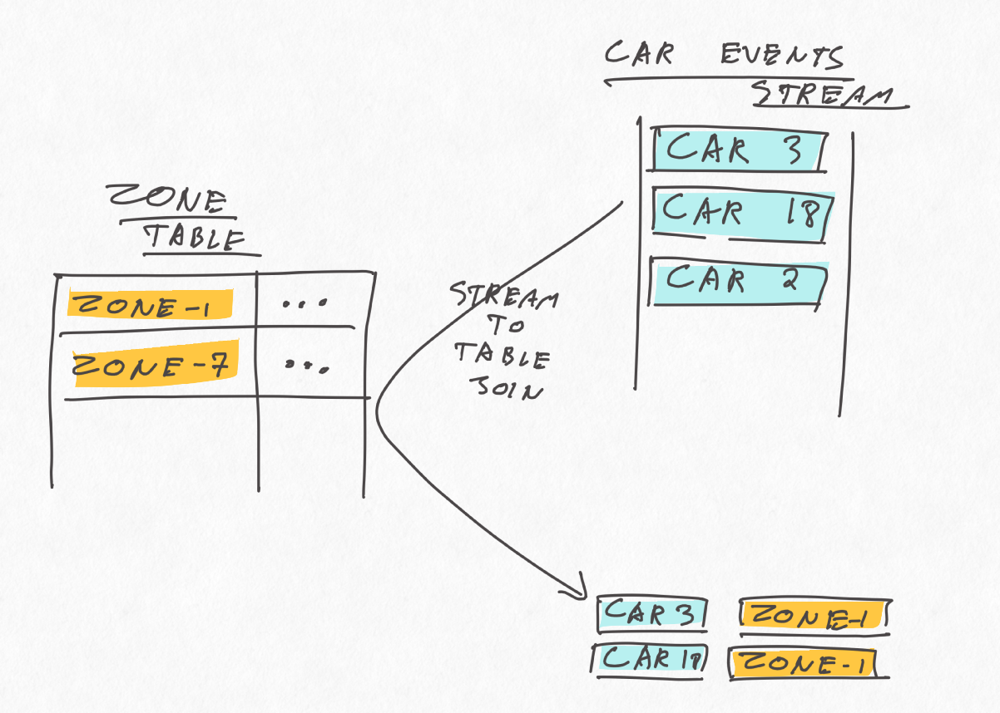

Title: One to many Kaka Streams Ktable join
Date: 2019-04-30
Tags: kafka
Author: Svend Vanderveken

Kafka Streams: lightweight. 

One limitation it currently has it the impossibility to join two KTables on something else than the partition key. 

This post illustate an approach ot work around the problem with the Processors API. I found the inspiration for this in the talk... as well as well as the stream to table join example by...

An example implementation is present on my github: 

# An example use case. 

Imagine a setup in which cars are moving around a city. We get notified regularly of the position of the car as well as of the pollution level in various locations, along these simple formats: 


```scala 
  case class CarArrivalEvent(car_id: Int, to_zone_id: Int, fuel_level: Double)
  case class ZoneEvent(zone_id: Int, pollution_level: Double)
```

The purpose is to maintain a view with, for each car, its latest position together with the pollution level at location. 

```scala 
  case class JoinedCarPollutionEvent(car_id: Int, zone_id: Int, fuel_level: Double, pollution_level: Double)
```

The twist is that we want to update that view anytime a new car position event is received or that the pollution level of a zone is updated. 

# Incomplete solution: stream to Ktable join

One attempt could be to maintain the latest pollution level per zone in one KTable and simply join the car location event stream to it, as follows: 



This is simple enough and should provide the correct results, but not often enough. This issue is that this join is updated only when a new car position event is received on the stream side, so when the pollution level of a zone changes, the view is not updated, which does not fulfill our requirements.


# Wasteful solution 2: key both tables by zoneId. 

The only kind of joins that gets updated whenever either side of the join receives an event is a KTable to KTable join, https://kafka.apache.org/21/documentation/streams/developer-guide/dsl-api.html#ktable-ktable-join. As mentioned in the introducton, those joins are (currently) only possible as equi-join the primary key. 

One somewhat hackish solution consists if building a "wide table" of car event, keyed by zoneId, and join it to the zone KTable, as follows: 


This should work and be updated as often as we want, but can be very inefficient due to write-amplification (any time a new car location event arrives, a whole car list row gets updated and event-sourced in the underlying topic) and all the shuffling. If the expected number of car events per wide row is high, this can lead to unacceptably low performance and high resource costs. 

# Ok-soon solution 3: KIP-213

We're not alone! A [PR](https://github.com/apache/kafka/pull/5527) by Adam Bellemare is currently on it way to Kafka that should hopefully resolve just that!

# OK solution: range scans on state store. 

Waiting for KIP-213 to reach Kafka Streams's trunk, or simply as an illustation of range scan, here's a manual solution based on the Processor API. 

The basic idea is to use a tall format instead of the wide format mentioned above, like this: 


The tall format has the advantage of avoiding write amplifications, while still allowing to retrieve all the car per zoneId. In way, it is similar to wide rows in Cassandra (without the sorting). 

Armed with this, we can store the car event following this tall format, while keeping the zone events keyed by zoneId as before. This yield the following stream overview: 


The state store for the zones is a usual key-value state store:
```scala
  val zoneEventStoreBuilder = Stores.keyValueStoreBuilder(
    Stores.persistentKeyValueStore("zone-events-store"),
    Serdes.Integer,
    DomainModel.JsonSerdes.zoneEventSerdes)
```

The state store for the cars is using a composite key: 

```
  case class ZoneCarId(zoneId: Int, carId: Int)

  val carArrivalEventStoreBuilder = Stores.keyValueStoreBuilder(
    Stores.persistentKeyValueStore("car-arrival-events-store"),
    ZoneCarId.zoneCarIdJsonSerdes,
    DomainModel.JsonSerdes.carArrivalEventSerdes)
```


Each of those state-store is "owned" by a separate Transformer instance: `CarEventLeftJoinZone` and `ZoneEventLeftJoinCar`.

Car events are partitioned by zone, then forwarded to the `CarEventLeftJoinZone`, which stores them, looks up the corresponding zone in the zone state store, and, if all goes well, emits a join result immediately: 

```scala
  // 
  carArrivalEventStore.put(
    ZoneCarId(carEvent.zoneId, carEvent.carId),
    CarArrivalEvent(carEvent.carId, carEvent.zoneId, carEvent.fuelLevel))

  // if we know the pollution level of that zone: emit a join result
  Option(zoneEventStore.get(carEvent.zoneId))
    .map { zoneEvent =>
      // logger.info("found a matching zone event to this car event!")
      JoinedCarPollutionEvent(carEvent.carId, carEvent.zoneId, carEvent.fuelLevel, zoneEvent.pollution_level)
    }
```

The pattern is very similar for the `ZoneEventLeftJoinCar`, except that the look-up in the car event state store is a range scan, potentially matching many can events in that zone. 

```scala
  zoneEventStore.put(zoneEvent.zone_id, zoneEvent)

  carArrivalEventStore
    .range(ZoneCarId(zoneEvent.zone_id, 0), ZoneCarId(zoneEvent.zone_id, Int.MaxValue))
    .asScala
    .foreach { kv =>

      val carEvent = kv.value
      this.processorContext.forward(carEvent.to_zone_id,
        JoinedCarPollutionEvent(carEvent.car_id, carEvent.to_zone_id, carEvent.fuel_level, zoneEvent.pollution_level)
      )
    }
```

You might have noticed that the car event processor receives ADD and DEL events instead of the raw car events. That's simply necessary to make sure each car is (eventually) recorded in only one zone at the same time. 

Again, for all this to make, make sure both streams are partitioned by zone-id. 


