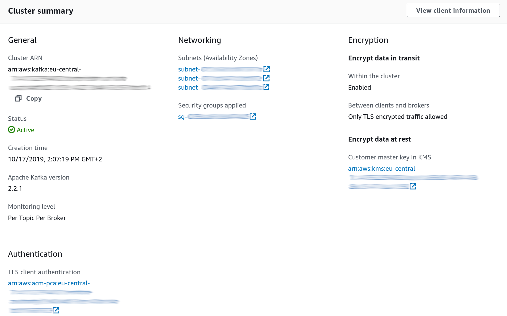

Title: AWS MSK secure Python Kafka client
Date: 2019-11-24
Tags: kafka, python, aws, security
Author: Svend Vanderveken

This blog describes how to write a secured python client for AWS MSK (i.e. Kafka) using TLS for authentication. 

Kafka offers various security options, including traffic encryption with TLS, client authentication with either TLS or SASL, and ACL for authorization. AWS MSK, the Kafka offering of AWS, currently only supports TLS as authentication mechanism. MSK is also [integrated with AWS IAM](https://docs.aws.amazon.com/msk/latest/developerguide/security_iam_service-with-iam.html), although not for controlling access at topic granularity but rather for cluster administration tasks (e.g. _describeCluster_,...)

In case you are interested in writting a java or scala client instead, have a look at [the official MSK documentation](https://docs.aws.amazon.com/msk/latest/developerguide/msk-authentication.html), which has served as the basis for this post. 

# Cloud side setup

## AWS ACM PCA

The TLS certificate that the client will use as proof of identity (see below) must be trusted by MSK. At present, the only way (that I know of) to achieve this is to create a certificate authority on AWS, link it to our MSK cluster and then use it to create certificates. 

Note well that AWS PCA is not a cheap service (like 400 EUR/month at the time of writing this). Also, since PCA will be issueing proofs of identity, you need to carefully restrict access to it.

For more information about AWS PCA, head to [AWS PCA documentation](https://docs.aws.amazon.com/acm-pca/latest/userguide/PcaWelcome.html)

## Enabling TLS on MSK

When configuring the MSK cluster, make sure you enable the TLS endpoint. It is possible to keep both the PLAINTEXT and the TLS endpoint open, although in production disabling PLAINTEXT is of course recommended. 

Also, make sure to enable TLS authentication, associating the ACM PCA mentioned above. 

Your resulting MSK config should kind of look like this: 



When connecting to the TLS endpoint, the principal of the application will be the one of its certificate, whereas when connecting over PLAINTEXT, its principal will be `ANONYMOUS`. 

## Protecting the ACLs

The current version of Kafka stores ACLs in Zookeeper, which should therefore be carefully secured well, as [described on the AWS documentation](https://docs.aws.amazon.com/msk/latest/developerguide/security_iam_service-with-iam.html). 

ACL can also be edited directly via the Kafka brokers, using the [Kafka admin api](https://kafka.apache.org/24/javadoc/index.html?org/apache/kafka/clients/admin/AdminClient.html), so you want to protect this access as well, by [restricting access to "ALTER --cluster"](https://docs.confluent.io/current/kafka/authorization.html#creating-non-super-user-acl-administrators) as appropriate.

# ACL

We're going to write a python application that reads from `topic-A` and writes to `topic-B`. This application will use `The-Great-Danton` as principal and `Danton` as Kafka consumer group id. 

Let's create the ACLs appropriate to this scenario: 

```shell
kafka-acls \
--authorizer-properties zookeeper.connect=...zookeeper URL here... \
--add --allow-principal "User:CN=The-Great-Danton" \
--consumer \
--group Danton \
--topic topic-A

kafka-acls \
 --authorizer-properties zookeeper.connect=...zookeeper URL here... \
 --add --allow-principal "User:CN=The-Great-Danton" \
 --producer \
 --topic topic-B
```

# Client certificate creation

We now need to create the application private key as well as obtain a certificate signed by our ACM PCA. 

First, create a private key and a certificate signing request (CSR):

```sh
openssl req \
       -newkey rsa:2048 -nodes -keyout danton-key.pem \
       -subj "/CN=The-Great-Danton" \
       -out danton.csr
```

Submit this CSR to the AWS PCA instance: 

```sh
aws acm-pca issue-certificate \
    --certificate-authority-arn ...the ACM PCA arn here... \
    --csr file://./danton.csr \
    --signing-algorithm "SHA256WITHRSA" \
    --validity Value=100,Type="DAYS" 
```    

If all goes well, you should obtain in return an ARN where you can download your signed certificate: 

```json
{
    "CertificateArn": "arn:aws:acm-pca:eu-central-1:..."
}
```

Go ahead and fetch it: 

```sh
aws acm-pca get-certificate \
    --certificate-authority-arn ...the ACM PCA arn here... \
    --certificate-arn ...the certificate ARN here... | \
    jq '.Certificate, .CertificateChain' | \
    sed 's/\\n/\n/g' | \
    tr -d \" > danton-certificate.pem
```

And you should be good to go. The files you need from the above are:

* `danton-key.pem`, your private key
* `danton-certificate.pem`, your signed certificate

# Python code 

Let's use Confluent's [python kafka client](https://github.com/confluentinc/confluent-kafka-python) to write the application

Armed with the setup above, a python consumer using TLS authentication is as simple as: 

```python
from confluent_kafka import Consumer, Producer

model_consumer = Consumer({
    'bootstrap.servers': ... the brokers TLS endpoint here...,
    'group.id': "Danton",
    'security.protocol': 'ssl',
    'ssl.certificate.location' :'/path/to/danton-certificate.pem',
    'ssl.key.location': '/path/to/danton-key.pem'
})
```

and a producer as simple as: 

```python
producer = Producer({
    'bootstrap.servers': ... the brokers TLS endpoint here...,
    'security.protocol': 'ssl',
    'ssl.certificate.location' :'/path/to/danton-certificate.pem',
    'ssl.key.location': '/path/to/danton-key.pem'
})
```

Since this python library is based on `librdkafka`, you will find here [all configuration options](https://github.com/edenhill/librdkafka/blob/master/CONFIGURATION.md).

Note that in order to validate the brokers' identity, the python client code above needs access to public certificates. By default, it's going to look them up in `/usr/lib/ssl/certs/` and `/usr/lib/ssl/cacert.pem`. See [Confluent Kafka python documentation](https://github.com/confluentinc/confluent-kafka-python#ssl-certificates) for more details. For example, on my (Fedora) laptop, the public certificates are installed elsewhere, so I had to add the following configuration: 

```python
    'ssl.ca.location': '/etc/pki/ca-trust/extracted/pem/tls-ca-bundle.pem',
```

# What have we got ?

In this post, I have illustrated a method to achieve TLS encryption and authentication between a python client and a Kafka cluster.

There is much more to security than just this setup of course. Among other things, the access to PCA as well as to the ACLs should be carefully protected. Also, you should probably have a good look at certificate validity period and revocation.

Note that end-user identity is nowhere involved here: the principal used during authentication is associated to the application as a whole. This sounds appropriate enough since it’s hard to think of a use case where end user identity would need to be propagated up to the brokers. If you really need this though, SASL is probably the way to go, although it’s not supported by MSK at this point. SASL can also be used for other ticket-based scenarios.

Finally, even if the approach above is illustrated in Python, any other library based on librdkafka should work just the same way. That means we can have applications written in tons of languages all interacting through Kafka and using the same approach for security. That’s pretty neat :)


# Versions

The code snippets above have been tested to work with the following versions (November 2019)

* Kafka 2.2.1 on MSK
* Confluent Python Kafka 1.2.0
* OpenSSL 1.1.1d
* AWS CLI 1.16.261
* Python 3.7.5
