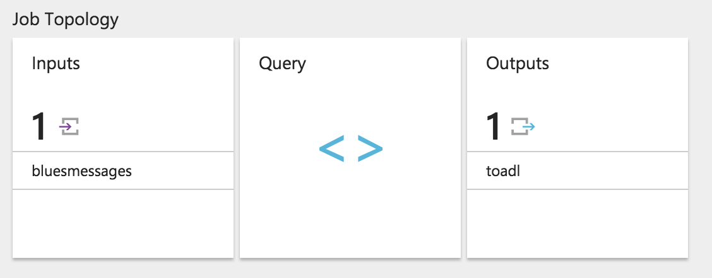
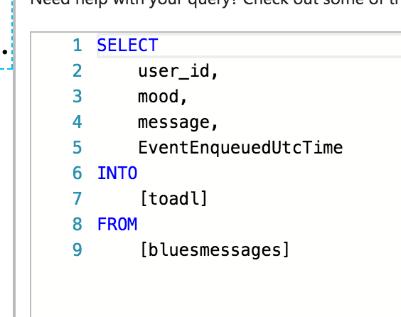
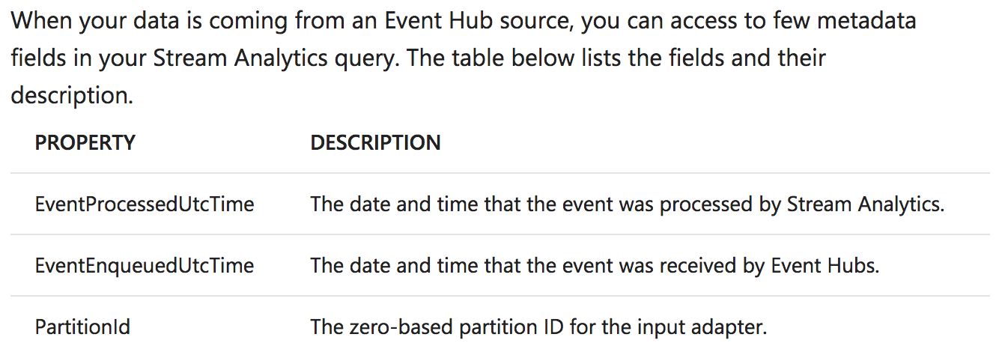
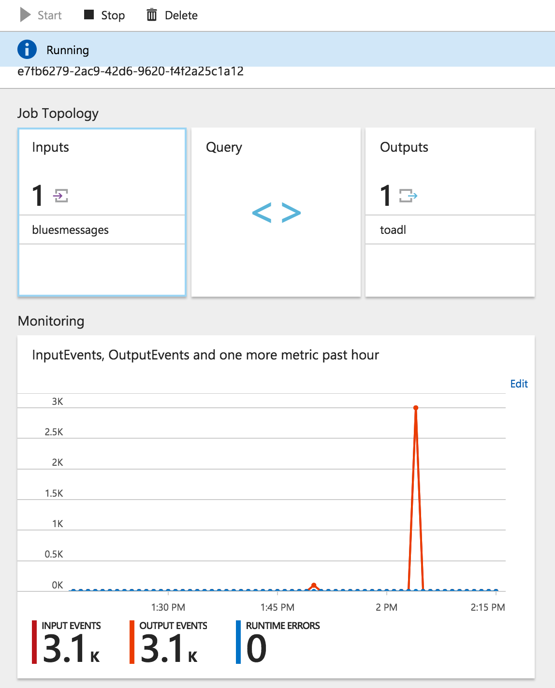

Title: Sending Avro records from Scala to Azure eventhub over AMQP
Date: 2017-06-26
Tags: avro, scala, azure, cloud
Author: Svend Vanderveken

This post illustrates how to emit Avro records to Azure EventHub from scala in such a way that they are directly parsed by the other services of the Azure platform (e.g. Azure Stream Analytics). 

There exists a Java API for communicating with Azure EventHub which is documented as part of the [azure documentation](https://docs.microsoft.com/en-us/azure/event-hubs/event-hubs-java-get-started-send) and even made [open source on github](https://github.com/Azure/azure-event-hubs-java) (things have changed at Microsoft...). That said, the most detailed documentation still seems to be based on the .NET API as manipulated with Visual Studio on Windows. Me being a Scala developer on a Mac, it took me a bit of experimentation to emit Avro messages to EventHub and have an Azure Stream Analytics job parse them correctly.

The steps below assume that you have access to the Azure portal and have created an EventHub namespace as well as an EventHub instance. If not, see the [Azure documentation here](https://docs.microsoft.com/en-us/azure/event-hubs/event-hubs-create) for details.

I posted a fully working example [here on github](https://github.com/svendx4f/avro-eventhub-scala-example).


## Scala Avro record emitter

In a nutshell, these are the few things to know when sending Avro to Azure EventHub: 

+ Each message sent to Azure is wrapped as part of an instance of [EventData](https://github.com/Azure/azure-event-hubs-java/blob/dev/azure-eventhubs/src/main/java/com/microsoft/azure/eventhubs/EventData.java), which also contains meta-data regarding the AMQP transmission.
+ The `byte[]` payload that we wrap inside an `EventData` instance should be a serialized Avro _file_, i.e. contain the Avro schema. This means we should use the Avro [DataFileWriter](https://github.com/apache/avro/blob/branch-1.8/lang/java/avro/src/main/java/org/apache/avro/file/DataFileWriter.java) and serialize the output directly to an output stream to obtain the `byte[]`.
+ As for any Avro file, it is possible, and actually a very good idea, to put several avro records within the `EventData`
+ Based on my experimentations, only uncompressed Avro records or records compressed with [Deflate](https://en.wikipedia.org/wiki/DEFLATE) seem to be currently supported by Azure. During my tests, neither bzip2 nor Snappy could be read by the Stream Analytics job. 

Here is an extract of the scala code (see [EventHubAvroSender on github](https://github.com/svendx4f/avro-eventhub-scala-example/blob/master/src/main/scala/org/svend/playground/EventHubAvroSender.scala) for details)

```scala
import com.microsoft.azure.eventhubs.{EventData, EventHubClient}
import org.apache.avro.file.{Codec, CodecFactory, DataFileWriter}
import org.apache.avro.generic.{GenericDatumWriter, GenericRecord}
import scala.collection.JavaConverters._

[...]

  val ehClient = EventHubClient.createFromConnectionStringSync("<your eventhub connection string>")

  // number of batches to send to the EventHub
  val batch_num = 10

  // number of EventData instances to put inside each batch
  val amqpMessagePerBatch = 15

  // number of avro records to bundle inside each AMQP message
  val userMessagesPerAmqp = 20

  val datumWriter = new GenericDatumWriter[GenericRecord](UserMessage.schema)
  val writer = new DataFileWriter[GenericRecord](datumWriter)

  // only Deflate seems to be compatible with Azure at the moment 
  writer.setCodec(CodecFactory.deflateCodec(9))  
  //writer.setCodec(CodecFactory.snappyCodec()) // not currently supported
  //writer.setCodec(CodecFactory.bzip2Codec())  // not currently supported

  val futures = (1 to batch_num)
    .map{ batchid =>

      // list of EventData instances, each with a bunch of Avro records
      val eventHubMessages = (1 to amqpMessagePerBatch).map { _ =>

        val bos = new ByteArrayOutputStream()
        writer.create(UserMessage.schema, bos)
      
        // MessageGen.genMessage is a generator of random data
        (1 to userMessagesPerAmqp).foreach { _ => writer.append(MessageGen.genMessage.toAvro)}

        writer.close()
        bos.close()
 
        new EventData(bos.toByteArray)
      }

      println(s"sending batch $batchid")

      // this sends a batch of EventData asynchronously and returns a Java Future
      ehClient.send(eventHubMessages.asJava)
    }

  println("waiting for all futures before exiting...")
  futures.foreach(_.get())

  println(s"ok, closing")
  ehClient.close()
```


Note that there are two batching mechanisms at play above: 

+ the set of `userMessagesPerAmqp` avro records we put inside each `EventData`
+ the set of `amqpMessagePerBatch` AMQP messages that are sent as part of one AMQP batch

I did not investigate what was the ideal combination of those two.


## Stream Analytics Job

Azure stream analytics usage is described in [Azure documentation here](https://docs.microsoft.com/en-us/azure/stream-analytics/), they essentially let you execute an on-going [U-SQL](https://docs.microsoft.com/en-us/azure/data-lake-analytics/data-lake-analytics-u-sql-get-started) query on data streaming out of an EventHub instance, IotHub instance or Blob Storage and forward the result to various outputs.

<center> </center>

All fields of the Avro schema are available in the query, so based on our example schema: 

```json
{
  "namespace": "svend.playground.user",
  "type": "record",
  "name": "User",
  "fields": [
    {"name": "user_id",  "type": ["int", "null"]},
    {"name": "mood",  "type": ["string", "null"]},
    {"name": "message", "type": ["string", "null"
  ]
}
```

We can access each field as part of a query in the U-SQL editor of the Azure Stream Analytics Job: 


<center> </center>

You might notice the presence of `EventEnqueuedUtcTime` in the query above, this is one of the supplementary fields that Azure EventHub adds to each received event, as [specified in the Azure documentation](https://docs.microsoft.com/en-us/azure/stream-analytics/stream-analytics-define-inputs):

<center> </center>

Once everything is started, the Stream Analytics page on the Azure portal should start to show some process traffic: 

<center> </center>


